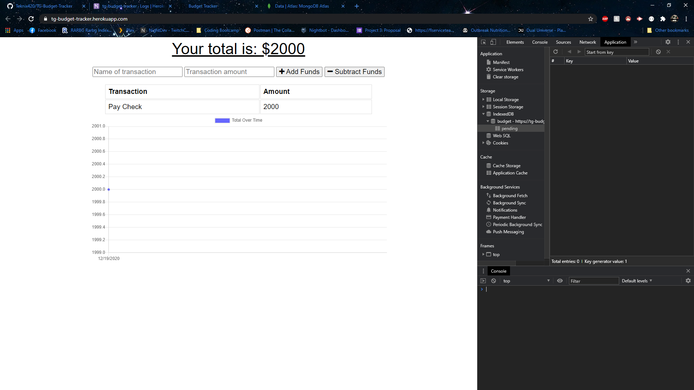
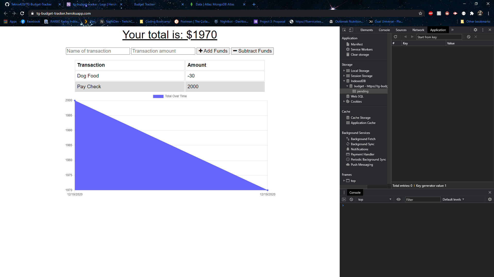
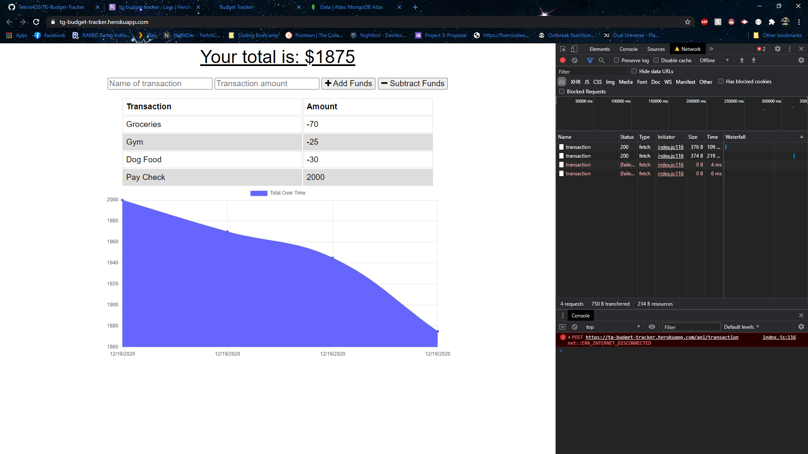
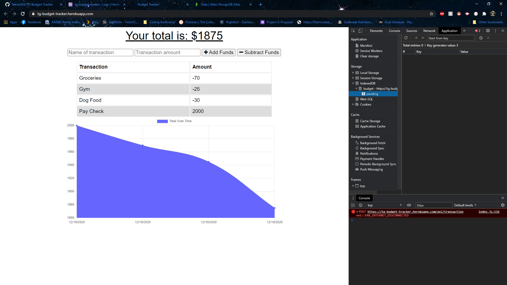
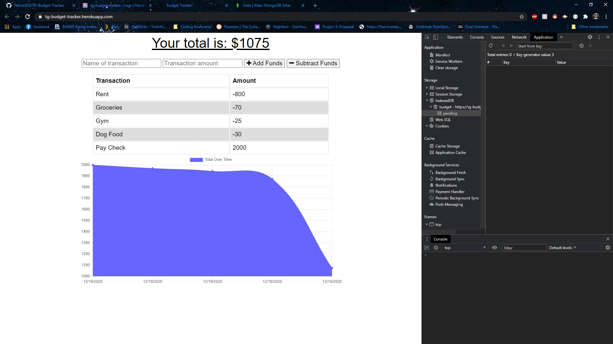

# TG-Budget-Tracker
## By Travis Gray

For this assignment, I was tasked with creating a file that provides offline functionality for a website. If a user is operating this website and loses internet connection for whatever reason, the website will still function and send the pending data to the database once an internet connection is restored.

## Instructions for Use

This is the main page that will display when coming to the website. Since the website doesn't have unique ID's stored, all information from everything that's been entered into the database will be visible to everyone visiting the site. I have the window open on the right to demonstrate the characteristics of the website and how they contribute to functionality of the site.

I've added and subtracted a couple of transactions to show how they appear on the app.

I've switched over to the network tab and disabled internet access for the site to do some testing. I've added two more transactions and they show up in red since they can't access the internet. There is also a console error down below showing that the internet has been disconnected. The site is still functional even though there's no internet connection.

I've switched the tab over from the Network tab to the Application tab to show how data is stored on the site. The IndexedDB stores database information while the site is offline, which is stored on the local machine. Values are added to the "pending" collection while the site is offline and will upload to the database once the internet connection has been restored.

I've turned the internet connection back on in the Network tab, and you can now see that a new connection has gone through called "bulk". This means that all of the information waiting in the "pending" collection is sent through to the database to be stored.

This screen is displaying the "pending" collection and how it has been cleared out now that the information has been sent over to the main online database.

And for the final touch, I've added another transaction and cleared out the console to show that the internet connection has been restored and that the transactions have been successfully saved within the online database. There were no hiccups with the site even when the connection was offline.

## Links

* [Github](https://github.com/Teknix420/TG-Budget-Tracker)
* [Heroku](https://tg-budget-tracker.herokuapp.com/)
